# 📆 WEEK-1 :
# TASK-1 :RISCV_Toolchain Setup Tasks 
## 🎯 Objective:
 To install RISCV_toolchain along with an ISA simulator and a Proxy kernel and some other base developer tools to develop, compile, simulate, and test RISC-V programs without real hardware.
 ## 📋 Prerequisites  
✅ Ubuntu 22.04 LTS (64-bit) installed (natively or in VirtualBox)  
✅ Terminal access with sudo privileges  
✅ Basic knowledge of Linux command line operations  
## Steps:
### TIP:
 Run `sudo apt-get update` once before proceeding with the steps. 
 ### 1️⃣ Install the base developer tools:
 Start by installing the base developer tools required by the RISC-V simulator,proxy terminal and others.
 ### 📦 Required Packages (Before Starting)

These packages must be installed before building RISC-V tools:

- `git` – for cloning repositories  
- `vim` – text editor  
- `autoconf`, `automake`, `autotools-dev` – to generate build scripts  
- `curl` – for downloading files  
- `libmpc-dev`, `libmpfr-dev`, `libgmp-dev` – math libraries needed for compiling  
- `gawk` – used in build scripts  
- `build-essential` – includes GCC, make, etc.  
- `bison`, `flex` – parser and lexer generators  
- `texinfo` – for generating documentation  
- `gperf` – creates perfect hash functions  
- `libtool`, `patchutils` – used for building and patching  
- `bc` – command-line calculator  
- `zlib1g-dev` – compression support  
- `libexpat1-dev` – XML parsing library  
- `gtkwave` – tool to view waveforms from digital simulations
Run the following command in the terminal:
``` bash
sudo apt-get install -y git vim autoconf automake autotools-dev curl libmpc-dev libmpfr-dev libgmp-dev gawk build-essential bison flex  texinfo gperf libtool patchutils bc zlib1g-dev libexpat1-dev gtkwave
```
# 📸 PROOF:

### 2️⃣Create a seperate workspace for RISCV-toolchain:
Creating a seperate folder makes it easier to access or remove or update the toolchain and the others related to it and store the homepath so that we dont need to type the working directory again and again.
Run:
``` bash 
cd
pwd=$PWD
mkdir -p riscv_toolchain 
cd riscv_toolchain
```
This creates a folder called riscv_toolchain in the system
### 3️⃣Install RISCV-GCC toolchain:
Install the toolchain in the folder riscv_toolchain
``` bash
wget "https://static.dev.sifive.com/dev-tools/riscv64-unknown-elf-gcc-8.3.0-2019.08.0-x86_64-linux-ubuntu14.tar.gz" 
tar -xvzf riscv64-unknown-elf-gcc-8.3.0-2019.08.0-x86_64-linux-ubuntu14.tar.gz
```
1. wget-This command will download file.tar.gz from the specified URL to your current folder.
2. tar-Extracts or compresses .tar, .tar.gz, or .tgz archive files.
## 📸 PROOF:


### 4️⃣Add toolchain to the path:
#### Command (current shell):
Updates the path
``` bash
export PATH=$pwd/riscv_toolchain/riscv64-unknown-elf-gcc-8.3.0-2019.08.0-x86_64-linux-ubuntu14/bin:$PATH
```
#### Command (persistent for new terminals):
Updates the path in the bash file
``` bash
echo 'export PATH=$HOME/riscv_toolchain/riscv64-unknown-elf-gcc-8.3.0-2019.08.0-x86_64-linux-ubuntu14/bin:$PATH' >> ~/.bashrc 
```
Run ` source `/.bashrc` (for updating the bash file)
#### TIP: use ` echo $PATH ` to verify whether the path is correct or not .
## 📸Proof:
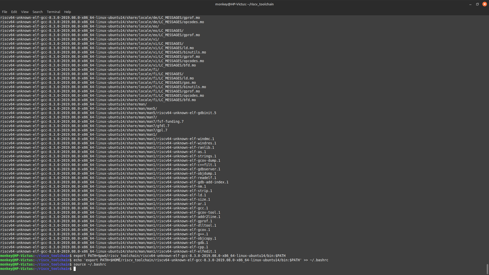
### 5️⃣Install the Device tree compiler:
Why?: Required for certain riscv-components
``` bash
sudo apt-get install -y device-tree-compiler
```
### 6️⃣Build and install Spike:
##### Why?:
 1. Spike is the official RISC-V ISA simulator. It allows you to:
2. Run and test RISC-V programs without real hardware
3. Simulate RISC-V ELF binaries generated by riscv64-unknown-elf-gcc
4. Validate program correctness using the spike pk a.out flow 
Install it in the same folder(riscv_toolchain)
``` bash
cd $pwd/riscv_toolchain #changes directory to riscv_toolchain
git clone https://github.com/riscv/riscv-isa-sim.git #clones the repo
cd riscv-isa-sim 
mkdir -p build && cd build #creates and opens the build in riscv-isa-sim
../configure --prefix=$pwd/riscv_toolchain/riscv64-unknown-elf-gcc-8.3.0-2019.08.0-x86_64-linux-ubuntu14 
make -j$(nproc) 
sudo make install #installs the file & sudo gives authority
```
#### Check whether the spike has been installed or not by executing this command in the terminal ` which spike ||spike -h`.
## 📸PROOF:
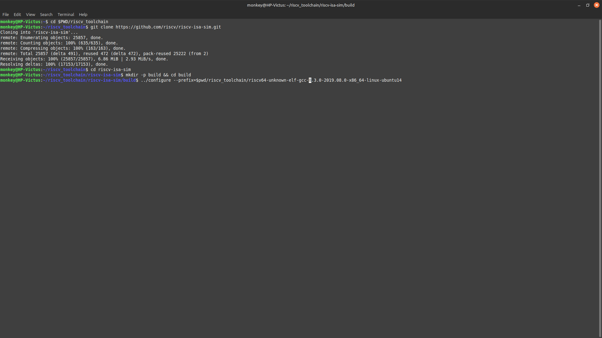
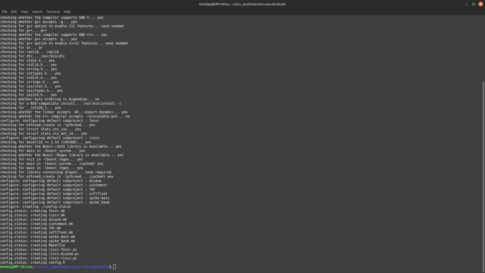
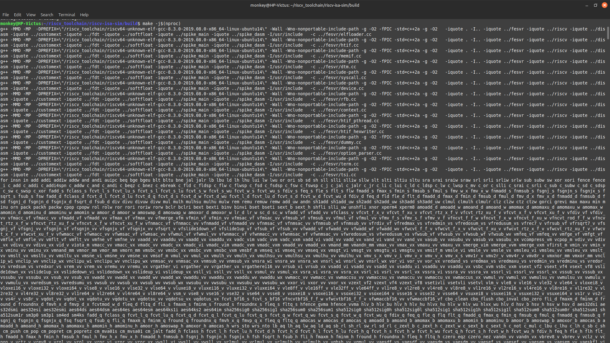
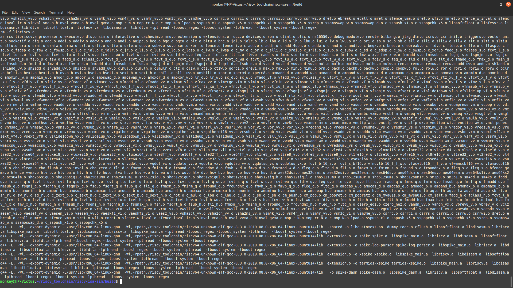
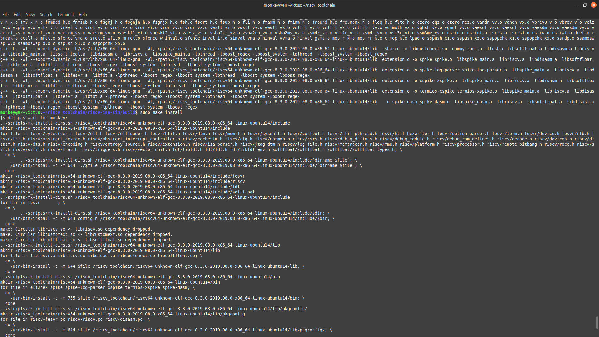

### 7️⃣Installing Proxy kernel:
 
To install the Proxy Kernel (`pk`) so that RISC-V ELF binaries can run on the Spike simulator using `spike pk ./your_program`.

## ⚙️ Steps to Install

```bash
cd $PWD/riscv_toolchain
git clone https://github.com/riscv/riscv-pk.git
cd riscv-pk
mkdir -p build && cd build
../configure --prefix=$PWD/../../riscv64-unknown-elf-gcc-8.3.0-2019.08.0-x86_64-linux-ubuntu14 --host=riscv64-unknown-elf
make -j$(nproc)
sudo make install
```
####  Check whether PK has been installed or not by executing this command in the terminal ` which pk`.

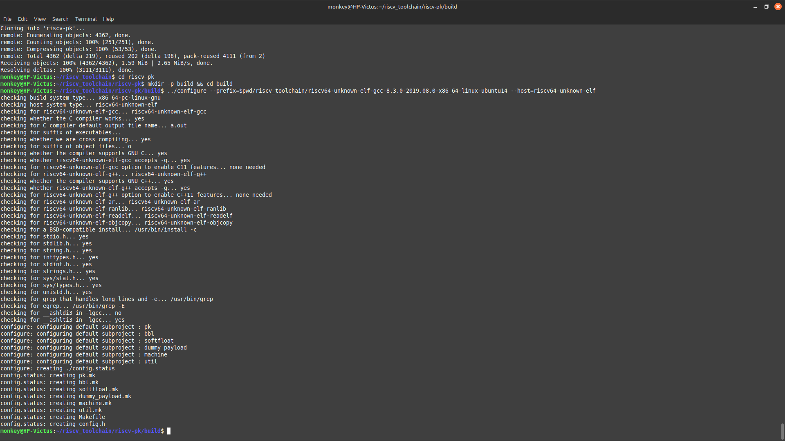
# ❗❗❗   NOTE(Error)
While executing the `make -j$(nproc) ` we encounter an issue stating that certain csr are missing .This arises due to the older version of the toolchain .
So to resolve it we use another version of the Proxy kernel .
#### Add  the below code just before the `cd riscv-isa-sim` and after the `git clone https://github.com/riscv/riscv-pk.git`,so that the issue will be resolved.We are using a differnt version of the PK.
``` bash
git checkout v1.0.0 
```


### ❗CAUTION :
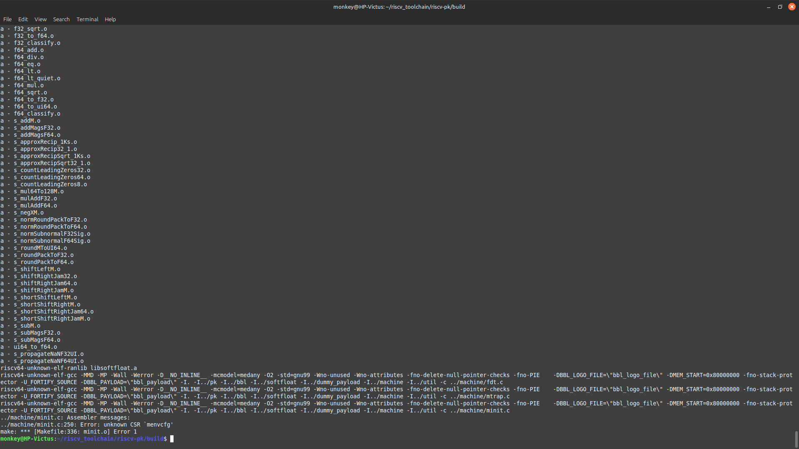
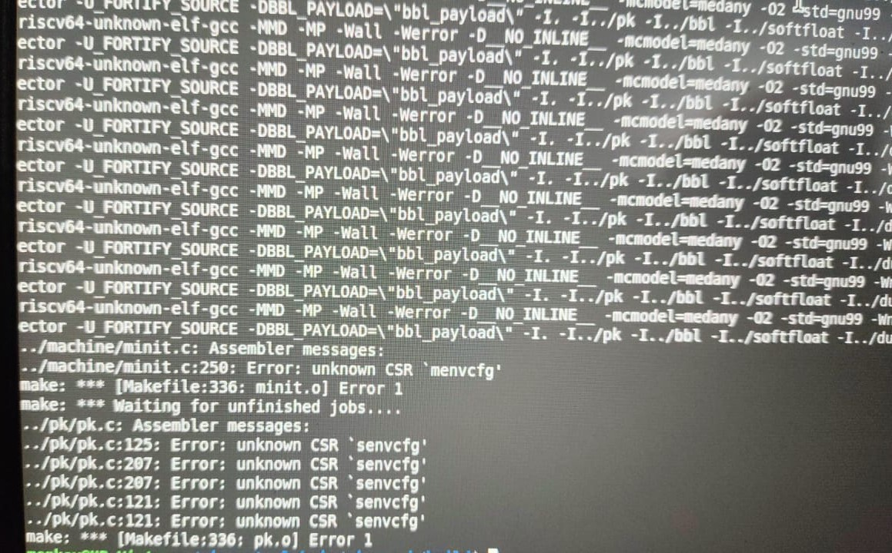
### 8️⃣ Update the path :
To make `pk`, `spike`, and other RISC-V tools accessible from any terminal without typing full paths.

#### For current shell:
```bash
export PATH=$PWD/riscv_toolchain/riscv64-unknown-elf-gcc-8.3.0-2019.08.0-x86_64-linux-ubuntu14/riscv64-unknown-elf/bin:$PATH
```
#### To make it permanent:
```bash
echo 'export PATH=$HOME/riscv_toolchain/riscv64-unknown-elf-gcc-8.3.0-2019.08.0-x86_64-linux-ubuntu14/riscv64-unknown-elf/bin:$PATH' >> ~/.bashrc
source ~/.bashrc
```
### 💡 TIP:Ensure whether the path is correct or not by using ` echo $PATH`.

# FINAL SANITY TEST:
To check whether all the above mentioned steps have been executed properly and the packages have been installed 
```bash
which riscv64-unknown-elf-gcc 
riscv64-unknown-elf-gcc -v
 which spike spike --version || spike -h 
 which pk
 ``` 
 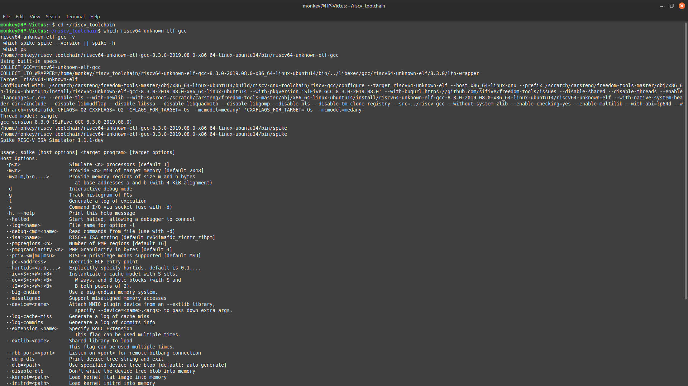
 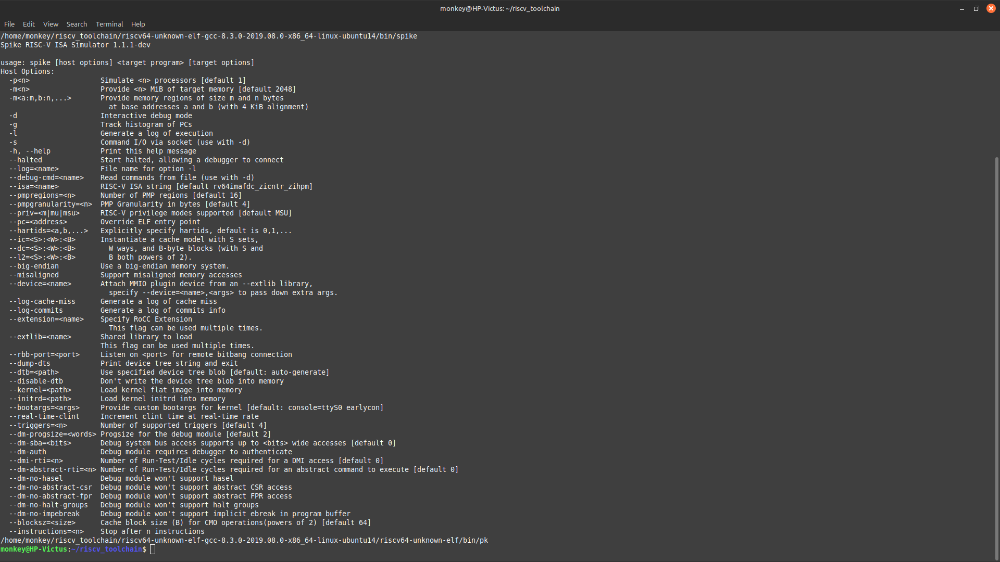
 ### This confirms whether the packages are installed properly .

#### NOW WE HAVE A PROPER AND EXECUTABE RISCV_TOOLCHAIN AND SPIKE(ISA SIMULATOR) ALONG WITH A PROXY KERNEL .

# TASK-2 :Uniqueness test
1. Now we are going to create a file named unique_test.c ,which is required for the uniqueness test.
``` bash
nano unique_test.c
```
And type the following code into it:
``` bash 
#include <stdint.h>
#include <stdio.h>

#ifndef USERNAME
#define USERNAME "unknown_user"
#endif

#ifndef HOSTNAME
#define HOSTNAME "unknown_host"
#endif

// 64-bit FNV-1a hash function
static uint64_t fnv1a64(const char *s) {
    const uint64_t FNV_OFFSET = 1469598103934665603ULL;
    const uint64_t FNV_PRIME = 1099511628211ULL;
    uint64_t h = FNV_OFFSET;
    for (const unsigned char *p = (const unsigned char*)s; *p; ++p) {
        h ^= (uint64_t)(*p);
        h *= FNV_PRIME;
    }
    return h;
}

int main(void) {
    const char *user = USERNAME;
    const char *host = HOSTNAME;
    char buf[256];
    int n = snprintf(buf, sizeof(buf), "%s@%s", user, host);
    if (n <= 0) return 1;

    uint64_t uid = fnv1a64(buf);

    printf("RISC-V Uniqueness Check\n");
    printf("User: %s\n", user);
    printf("Host: %s\n", host);
    printf("UniqueID: 0x%016llx\n", (unsigned long long)uid);

#ifdef __VERSION__
    unsigned long long vlen = (unsigned long long)(sizeof(__VERSION__) - 1);
    printf("GCC_VLEN: %llu\n", vlen);
#endif

    return 0;
}
```
Save the file and exit.

2. Then compile with injected identity and RISC‐V flags:
``` bash
riscv64-unknown-elf-gcc -O2 -Wall -march=rv64imac -mabi=lp64 \
-DUSERNAME="\"$(id -un)\"" -DHOSTNAME="\"$(hostname -s)\"" \
unique_test.c -o unique_test
```
3. Run on Spike with the proxy kernel
```bash
spike pk ./unique_test
```
### The expected output is : 
RISC-V Uniqueness Check
User: <your-username>
Host: <your-hostname>
UniqueID: 0x<64-bit-hex>
GCC_VLEN: <number>
# 📸 OUTPUT:
#### RISC-V Uniqueness Check
#### Host: HP-Victus
#### UniqueID: 0x569cd4904135f655
#### GCC_VLEN: 5


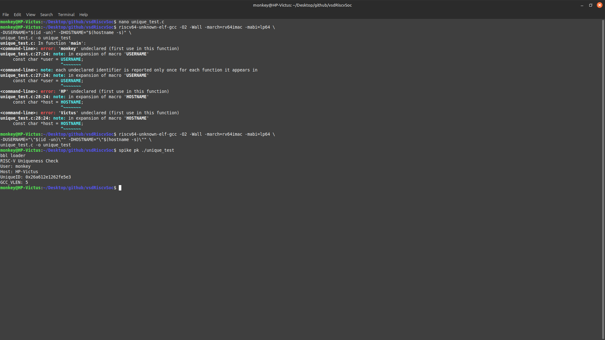

## ERROR:
❌ Incorrect Version:
```bash
riscv64-unknown-elf-gcc -O2 -Wall -march=rv64imac -mabi=lp64 \
-DUSERNAME="$(id -un)" -DHOSTNAME="$(hostname -s)" \
unique_test.c -o unique_test
Problem: The USERNAME and HOSTNAME values are passed without quotes.
```
Caused compiler errors like:
'monkey' undeclared or invalid token HP-Victus.

✅ Correct Version:
``` bash
riscv64-unknown-elf-gcc -O2 -Wall -march=rv64imac -mabi=lp64 \
-DUSERNAME="\"$(id -un)\"" -DHOSTNAME="\"$(hostname -s)\"" \
unique_test.c -o unique_test
```
Fix: The extra \" wraps the values in quotes, making them valid C string .
Resolves the issue

 # ✅ ***RESULT***
 1. ☑️ Installed the RISCV-toolchain,
 2. ✅ Installed Spike(ISA simulator) and Proxy Kernel,
 3. ☑️ verified the tools,
 4. ✅ Ran a uniqueness test .


