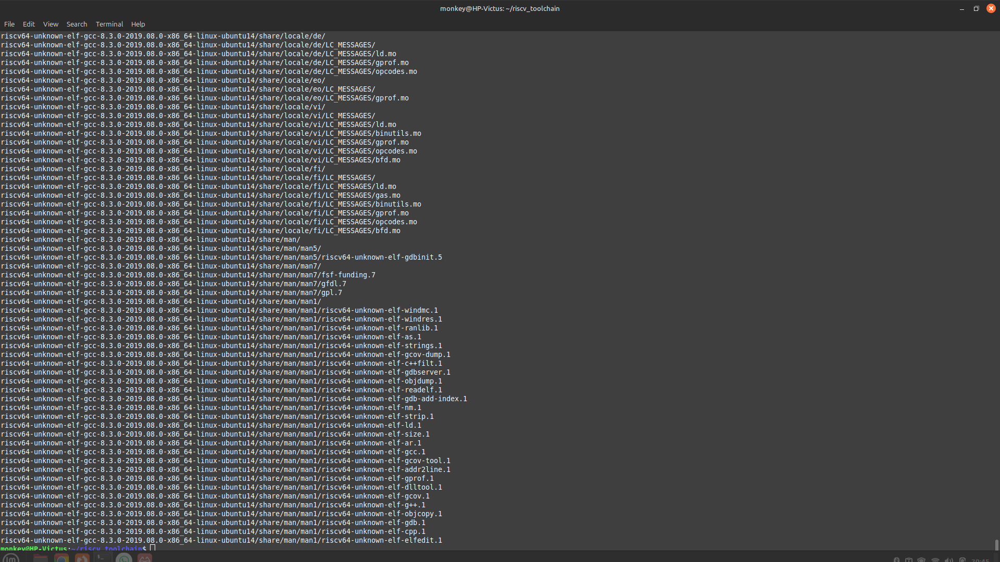

# 🛠️WEEK-1:Task1 - RISC-V Toolchain Setup Tasks & Uniqueness Test 

## 🎯 OBJECTIVES:
   To set up a complete RISC-V development and simulation environment on Ubuntu (native or VirtualBox) by installing essential developer tools, a prebuilt RISC-V GNU Toolchain, the Spike ISA simulator, the Proxy Kernel, and optional tools like Icarus Verilog(Optional) for digital design. 

## 🧰PREREQUISITES
1. ✅ Linux-Ubuntu (either dualboot or in virtualbox)
2. ✅ Basic knowledge of linux terminal commands 
## STEPS:
 Note: Try running `sudo apt-get update` before proceeding with the upcoming steps to ensure all the packages present in the system are updated.
 If not update it 

## 1. Install Base Developer Tools

To set up the RISC-V toolchain, start by installing essential development packages.For ex

#### 🔧 Install Command

``` bash
sudo apt-get install -y git vim autoconf automake autotools-dev curl \
libmpc-dev libmpfr-dev libgmp-dev gawk build-essential bison flex \
texinfo gperf libtool patchutils bc zlib1g-dev libexpat1-dev gtkwave 
``` 
After installing you can verify it 

 
## 2. Create a clean folder to keep all RISC-V files organized & install the toolchain
 Type the following:
```bash
cd
pwd=$PWD
mkdir -p riscv_toolchain
cd riscv_toolchain
```
then run the following commands to install the toolchain

 ```
 wget "https://static.dev.sifive.com/dev-tools/riscv64-unknown-elf-gcc-8.3.0-2019.08.0-x86_64-linux-ubuntu14.tar.gz"
 ```

 ``` 
 tar -xvzf riscv64-unknown-elf-gcc-8.3.0-2019.08.0-x86_64-linux-ubuntu14.tar.gz
 ```
 ### OUTPUT:
 
 
 ## 3. Add Toolchain to PATH

Add the toolchain to your PATH so you can use RISC-V commands from anywhere.

``` bash
# Temporary (current terminal only)
export PATH=$PWD/riscv_toolchain/riscv64-unknown-elf-gcc-8.3.0-2019.08.0-x86_64-linux-ubuntu14/bin:$PATH

# Permanent (applies to all future terminals)
echo 'export PATH=$HOME/riscv_toolchain/riscv64-unknown-elf-gcc-8.3.0-2019.08.0-x86_64-linux-ubuntu14/bin:$PATH' >> ~/.bashrc
source ~/.bashrc
```
# Task 6 — Build and Install Spike (RISC‑V ISA Simulator)

## 🎯 Objective
To build and install the Spike simulator for running RISC-V ELF binaries.

## ⚙️ Steps to Install

```bash
cd $PWD/riscv_toolchain
git clone https://github.com/riscv/riscv-isa-sim.git
cd riscv-isa-sim
mkdir -p build && cd build
../configure --prefix=$PWD/../../riscv64-unknown-elf-gcc-8.3.0-2019.08.0-x86_64-linux-ubuntu14
make -j$(nproc)
sudo make install


 


        
