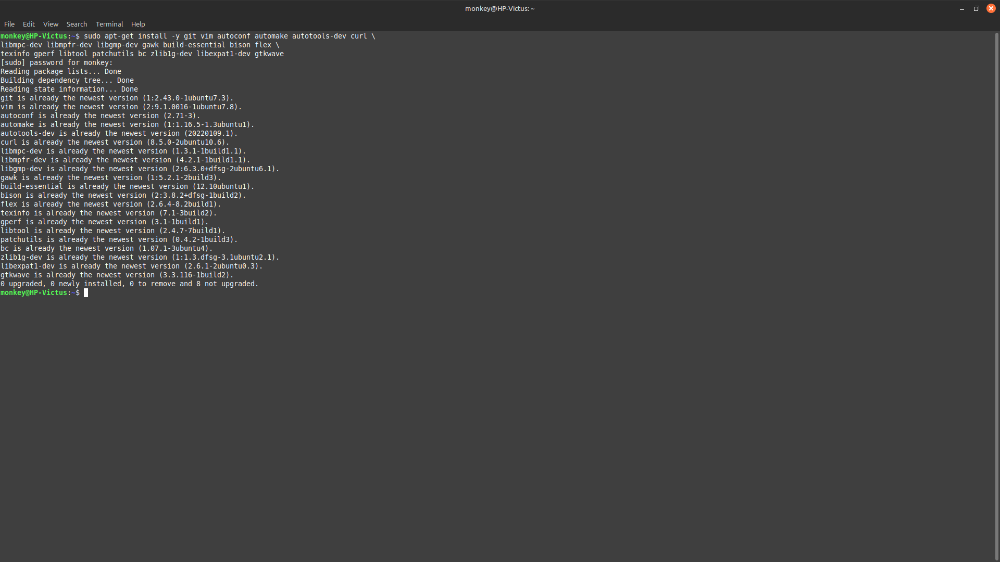
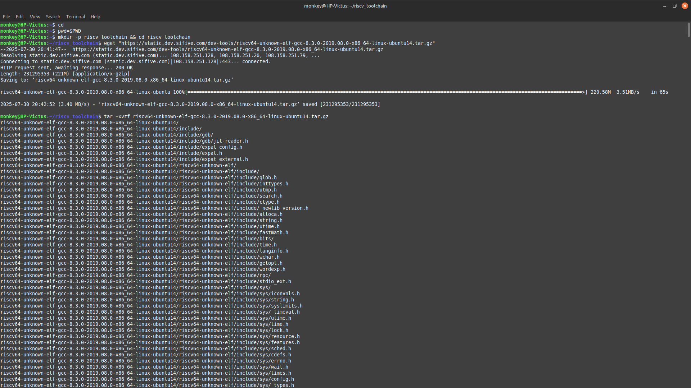
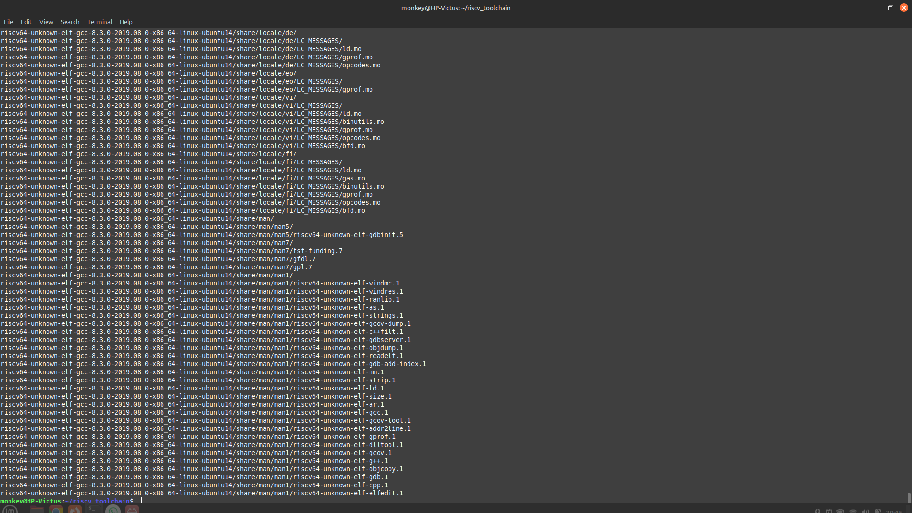

# 🛠️ WEEK-1: Task 1 - RISC-V Toolchain Setup & Uniqueness Test

## 🎯 OBJECTIVES:
Set up a complete RISC-V development and simulation environment on Ubuntu (native or in VirtualBox). This includes essential developer tools, a prebuilt RISC-V GNU Toolchain, the Spike ISA simulator, the Proxy Kernel, and optional tools like Icarus Verilog for digital design.

---

## 🧰 PREREQUISITES
1. ✅ Linux (Ubuntu – dual boot or virtual machine)
2. ✅ Basic knowledge of terminal commands

---

## ⚙️ Before You Start

Run the following command to make sure your package list is up to date:

```bash
sudo apt-get update
```

---

## 1️⃣ Step 1 — Install Base Developer Tools

Install essential build tools and libraries required for RISC-V tools.

```bash
sudo apt-get install -y git vim autoconf automake autotools-dev curl \
libmpc-dev libmpfr-dev libgmp-dev gawk build-essential bison flex \
texinfo gperf libtool patchutils bc zlib1g-dev libexpat1-dev gtkwave
```

📸 **Proof:**


---

## 2️⃣ Step 2 — Create Workspace Directory

Make a folder to organize all RISC-V related files.

```bash
cd
pwd=$PWD
mkdir -p riscv_toolchain
cd riscv_toolchain
```

---

## 3️⃣ Step 3 — Download and Extract RISC-V Toolchain

Get the prebuilt toolchain archive and extract it.

```bash
wget "https://static.dev.sifive.com/dev-tools/riscv64-unknown-elf-gcc-8.3.0-2019.08.0-x86_64-linux-ubuntu14.tar.gz"

tar -xvzf riscv64-unknown-elf-gcc-8.3.0-2019.08.0-x86_64-linux-ubuntu14.tar.gz
```

📸 **Output:**
  


---

## 4️⃣ Step 4 — Add Toolchain to PATH

Add the toolchain to your terminal path so you can use it from anywhere.

```bash
# Temporary (only for current terminal session)
export PATH=$PWD/riscv64-unknown-elf-gcc-8.3.0-2019.08.0-x86_64-linux-ubuntu14/bin:$PATH

# Permanent (applies to all future sessions)
echo 'export PATH=$HOME/riscv_toolchain/riscv64-unknown-elf-gcc-8.3.0-2019.08.0-x86_64-linux-ubuntu14/bin:$PATH' >> ~/.bashrc
source ~/.bashrc

# ✅ Verify installation
riscv64-unknown-elf-gcc --version
```

---

## 5️⃣ Step 5 — Install DTC (Device Tree Compiler)

Some RISC-V tools need this to read hardware configuration files.

```bash
sudo apt-get install -y device-tree-compiler
```

---


