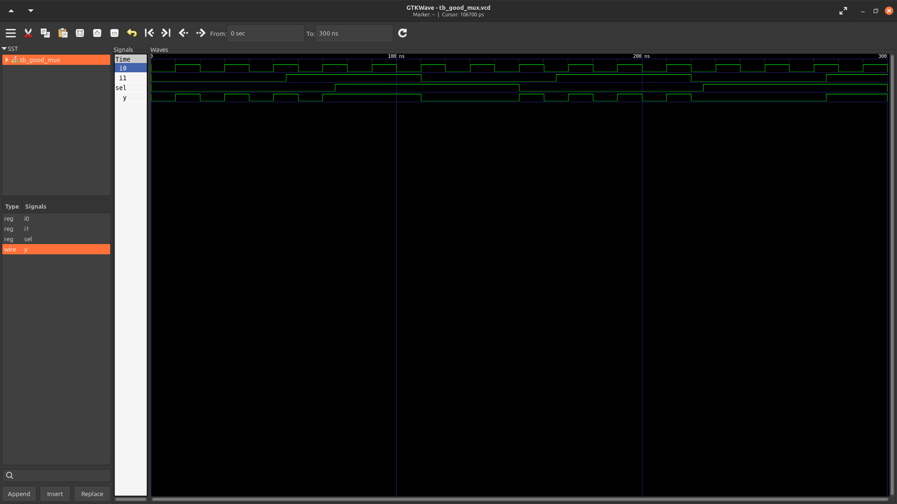
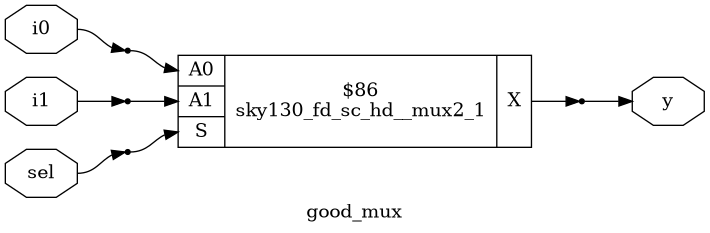
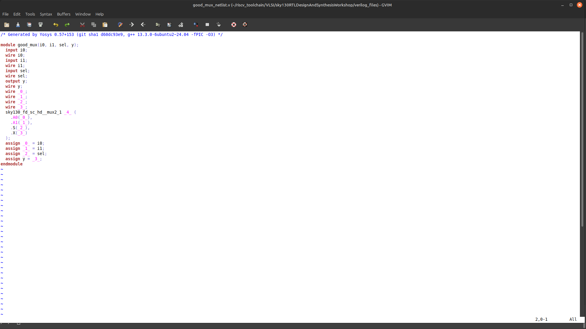

# 1️⃣DAY-1 :

Welcome to day-1 of the vsd riscv_workshop.This is the first session after the inaugural week. Today we are going to learn about the basics of RTL design,how to use iverilog ,what is a simulator,what is a synthesizer,how to verify the design using iverlog and synthesizer and much more.Stay tuned..
# INTRODUCTION TO IVERILOG(a open source simulator):

### 🎮What is a simulator?: 
It is a tool used for checking the RTL Design. RTL design is the actual verilog code which has the intended functionality to meet with the required specifications(or)actual implementation of specs.It is verified using iverilog(simulator)
### 🧰 What is testbench?:
It is the setup to apply the stimulus to the design to check its functionality.
### ⚙️How simulator works?:
1. Looks for changes in the input.
2. Upon changes the output is evaluated
3. *NOTE:* IF no change in i/p there is no change in o/p. evaluator will not evaluate.
## LAB-1 : Simulating a simple MUX:
 We are going to simulate a 2:1 MUX.
### 1️⃣Clone the repositry : 
 ~~~bash
 git clone https://github.com/kunalg123/sky130RTLDesignAndSynthesisWorkshop.git
 cd sky130RTLDesignAndSynthesisWorkshop/verilog_files
~~~
### 2️⃣Simulate the design:
~~~bash
iverilog  good_mux.v tb_good_mux.v //load the verilog file and the corresponding testbench file it creates a a.out file
./a.out                            //dumps the  vcd file
gtkwave tb_good_mux.vcd            //loads the file into gtkwave
~~~
### 3️⃣Verilog code : 
~~~bash 
gvim tb_good_mux.v -o good_mux.v   // opens the corresponding file in the text editor

###

module good_mux (input i0 , input i1 , input sel , output reg y);
always @ (*)
begin
	if(sel)
		y <= i1;
	else 
		y <= i0;
end
endmodule

~~~
### It has inputs i0,i1,sel and output y.If sel=1 the op is i1 and if sel=0 the output is i0.
### Corresponding waveforms:

----
## 🧬Introduction to yosys:
YOSYS : It is a synthesizer.Synthesizer is a tool used for converting the RTL design to netlist.

NETLIST:Representation of design in standard cell format .

What is synthesis?:  RTL to gate level translation. Design is converted into gates and the connections are made in between the gates. The output is given as a netlist file.

NOTE: Set of input and output is the same betweem the RTL design and the synthesized netlist . It uses the same testbench file.

#### 1)RTL code -----> Synthesized ------>Digital logic circuit
### What is a .lib file?;
1. It is a collection of logic modules and it is rich enough to implement any logic function.
2. It contains different flavours of gates.It contains gates which operate at different speed.
3. Why? : For adjusting the circuit to meet both the criteria required for hold issues(slow cells are used)and we need fast cells to meet the requirement of the design.
4. Performance : Depends upon the  depends upon the power consumed and area of the transistor used in the gate:
5. More use of faster cells : bad circuit in terms of power and area (as performance power and area are tradeoffs of eachother)
6. More use of slower cells : Circuit is sluggish(may not meet the required performance )
### LAB:
~~~ bash
yosys                                                                   //To invoke yosys
read_liberty -lib ../relative path to/sky130_fd_sc_hd__tt_025C_1v80.lib //To read the library
read_verilog good_mux.v                                                 //To read the file
synth_top good_mux                                                     
abc -liberty ../relative path to/sky130_fd_sc_hd__tt_025C_1v80.lib       // to generate lib.file
show                                                                    //to visualize logic
write_verilog good_mux_netlist.v                                        // to generate the netlist.file
!gvim good_mux_netlist.v                                                //to open the corresponding file

~~~

## LOGIC:

## NETLIST:

---
## SUMMARY:
1. Learnt about simulator ,synthesizer,RTL design and testbench
2. Simulated certain RTL design
3. Synthesized the same RTL design
4. Viewed the logic
WILL BE CONTINUED

