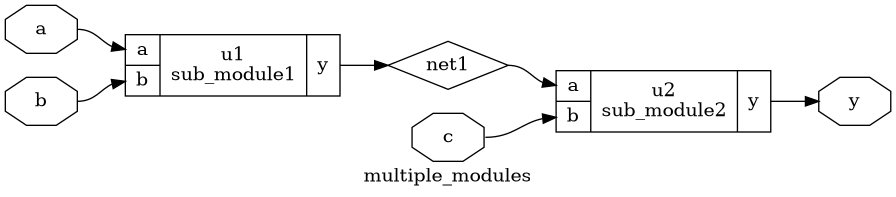
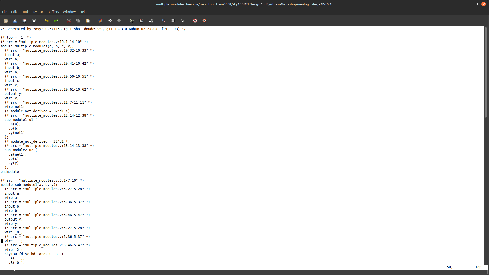
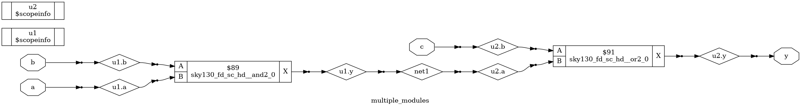
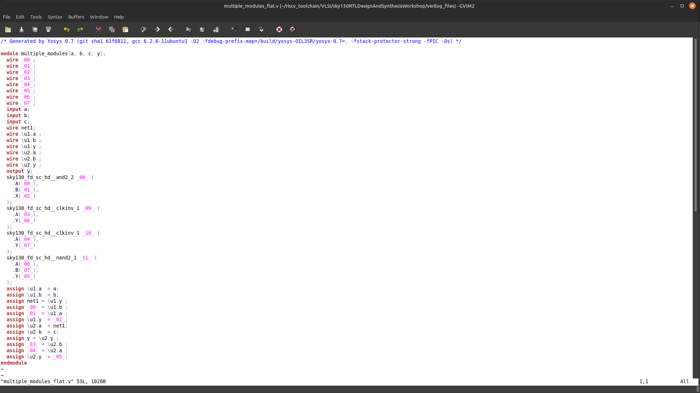

# DAY-2: Timing libs,hierarchial vs flat synthesis and efficient flop coding styles
### What are the parameters of a particular lib?

It depends upon the P -procss ,V -voltage,T-temperature.
Now for the sky130_fd_sc_hd_tt_025c_1v80.lib
1. The tt stands for :-typical process
2. 025c :- stands for temperature
3. 1v80 :- stands for voltage.

## Exploring the lib file:

~~~ bash
gvim   sky130_fd_sc_hd_tt_025c_1v80.lib 
~~~

## Hierarchial synthesis
 Retains the module hierarchy as defined in RTL, synthesizing modules separately.

Tools like Yosys process each module independently, using commands such as hierarchy to analyze and set up the design structure.

Faster synthesis time for large designs.
Improved debugging and analysis due to maintained module boundaries.
Modular approach, aiding integration with other tools.

Cross-module optimizations are limited.
Reporting can require additional configuration.

Each and every submodule is present .NO chnages

## Flattened synthesis:
Flattened synthesis is a technique in digital design where the tool breaks down the hierarchy and represents the circuit as one large, single-level structure. Instead of keeping modules and submodules separated, the synthesis engine merges them so that the entire design can be optimized as a whole. This often leads to better performance because the tool can see across boundaries that would normally restrict optimizations. However, the trade-off is that the netlist becomes harder to interpret, since the original block structure is lost, and this can make debugging or analyzing reports more challenging. Additionally, for very complex designs, flattening may require more computation time and memory, as the unified netlist can grow significantly in size.

## FLIP FLOP CODING STYLES:
