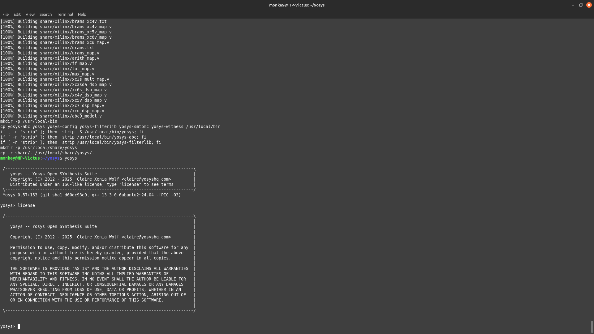

# 🏁 WEEK-0 : VSD RISC-V SOC workshop tools installation:
    This week we are starting with the foundation of RISCV-SOC workshop. We start with installing the basic developer tools like yosys,ngspice,magic and much more.
---
# ✅ Prerequisites: 
~~~ bash
As mentioned in the previous tasks the minimum requiremens are :(can be used as dual boot or in virtual machine)
 1️⃣ 💻 OS      : Ubuntu 20.04+
 2️⃣ 💾RAM     :6 gb
 3️⃣ 💿Storage :50 gb
 4️⃣ 🎰Vcpus   : 4
~~~
## ⚙️TOOLS:
## 1️⃣YOSYS:
~~~ bash
WHY  YOSYS❓:
Yosys is a versatile open-source framework that converts high-level hardware descriptions, like Verilog, into a gate-level netlist, supporting applications from ASIC and FPGA synthesis to formal verification and custom design workflows 
~~~
~~~ bash
$ sudo apt-get update
$ git clone https://github.com/YosysHQ/yosys.git
$ cd yosys$ sudo apt install make (If make is not installed please install it)
$ sudo apt-get install build-essential clang bison flex \libreadline-dev gawk tcl-dev libffi-dev git \graphviz xdot pkg-config python3 libboost-system-dev \libboost-python-dev libboost-filesystem-dev zlib1g-dev
$ make config-gcc
$ make
$ sudo make install
~~~
### VERIFICATION 📷:

---
## 2️⃣Iverilog:
~~~bash
Why IVERILOG❓:
Icarus Verilog (iVerilog) is an open-source Verilog compiler and simulator used for designing and verifying digital circuits.
~~~

~~~bash
sudo apt-get update
sudo apt-get install iverilog
~~~
### VERIFICATION 📷:

---
## GTKWAVE:
~~~bash
sudo apt-get update
sudo apt install gtkwave
~~~
### VERIFICATION 📷:

## NGSPICE : 
~~~bash
WHY ngspice ❓:
NGSPICE is a free and open-source circuit simulator used for analog and mixed-signal circuit analysis, favored for its versatility and cost-effectiveness.
~~~
Install the tar file for ngspice fromthttps://sourceforge.net/projects/ngspice/files/ to a local
directory, unpack it using
~~~bash
$ tar -zxvf ngspice-37.tar.gz
$ cd ngspice-37
$ mkdir release
$ cd release
$ ../configure --with-x --with-readline=yes --disable-debug
$ make
$ sudo make install 
~~~
### VERIFICATION 📸:

---
## MAGIC : 
~~~ bash
Magic is a free, open-source VLSI layout tool used for designing the physical geometry of integrated circuits.
~~~
### CODE:
~~~bash
sudo apt-get install m4
$ sudo apt-get install tcsh
$ sudo apt-get install csh
$ sudo apt-get install libx11-dev
$ sudo apt-get install tcl-dev tk-dev
$ sudo apt-get install libcairo2-dev
$ sudo apt-get install mesa-common-dev libglu1-mesa-dev
$ sudo apt-get install libncurses-dev
git clone https://github.com/RTimothyEdwards/magic
cd magic
./configure
make
make install 
~~~
### VERIFICATION 📸:

---
## OPENLANE:
OpenLane is a free and open-source automated toolchain that transforms a high-level digital design into a complete, manufacturable physical layout of an integrated circuit.

~~~bash
sudo apt-get update
sudo apt-get upgrade
sudo apt install -y build-essential python3 python3-venv python3-pip make git 
sudo apt install apt-transport-https ca-certificates curl software-properties-common
curl -fsSL https://download.docker.com/linux/ubuntu/gpg | sudo gpg --dearmor -o
/usr/share/keyrings/docker-archive-keyring.gpg
echo "deb [arch=amd64 signed-by=/usr/share/keyrings/docker-archive-keyring.gpg]
https://download.docker.com/linux/ubuntu $(lsb_release -cs) stable" | sudo tee
/etc/apt/sources.list.d/docker.list > /dev/null
sudo apt update
sudo apt install docker-ce docker-ce-cli containerd.io
sudo docker run hello-world
sudo groupadd docker
sudo usermod -aG docker $USER
sudo reboot
# After reboot
docker run hello-world
~~~
### VERIFICATION 📸:

## Checking dependencies:
### VERIFICATION 📸:

## 🎯RESULT : Successfully installed  ✔️**YOSYS ✔️ iverilog ✔️GTKWAVE ✔️ngspice ✔️ magic vlsi**

### [WEEK-1](https://github.com/Nishanth-error/vsdRiscvSoc/tree/main/riscv-task1-Nishanth)
### [WEEK-2](https://github.com/Nishanth-error/vsdRiscvSoc/tree/main/riscv-task2-Nishanth)
These are the previous tasks carried out by me under the guidance of VSD team.
Use the above mentioned link to check those repos.

