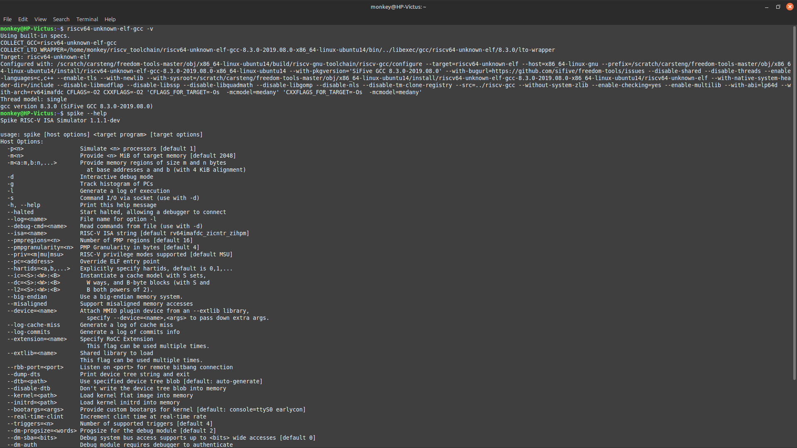

# WEEK-2: 
## TASK-2:Proving our local riscv setup (Run,assembly ,disassembly)
### 🎯Objectives:
Run 3–4 RISC-V C programs on your own PC, show their assembly output, manually decode a few instructions, and make sure the output proves it was run on your unique machine using your username, hostname, machine ID, and time.

# 🛠️ PREREQUISITES:
### 1️⃣ RISCV-TOOLCHAIN :INSTALL ✅ (check riscv-task1-Nishanth )
# STEPS : 
### 1️⃣Create a unique.h 
#### What it does ❓:
It prints who, when, where, and how the program was compiled.

Used to prove you ran the program on your own RISC-V setup.
#### What it shows
1. 👤 Username
2. 🖥️ Hostname
3. 🧬 Machine ID
4. 🕒 Build time (UTC + Epoch)
5. 🛠️ GCC version
6. 📦 Program name
7. 🔐 ProofID & RunID (unique numbers)
~~~ c
#ifndef UNIQUE_H
#define UNIQUE_H

#include <stdio.h>
#include <stdint.h>

// Declare these as extern if passed via -D flag in GCC
#ifndef USERNAME
#define USERNAME "unknown"
#endif

#ifndef HOSTNAME
#define HOSTNAME "unknown"
#endif

#ifndef MACHINE_ID
#define MACHINE_ID "unknown"
#endif

#ifndef BUILD_UTC
#define BUILD_UTC "unknown"
#endif

#ifndef BUILD_EPOCH
#define BUILD_EPOCH 0
#endif

static inline void uniq_print_header(const char *program_name, uint64_t proof, uint64_t runid) {
    printf("User    : %s\n", USERNAME);
    printf("Host    : %s\n", HOSTNAME);
    printf("Machine : %s\n", MACHINE_ID);
    printf("UTC     : %s\n", BUILD_UTC);
    printf("Epoch   : %lu\n", (unsigned long)BUILD_EPOCH);
    printf("GCC     : %s\n", __VERSION__);
    printf("Program : %s\n", program_name);
    printf("ProofID : 0x%016llx\n", (unsigned long long)proof);
    printf("RunID   : 0x%016llx\n", (unsigned long long)runid);
}


#endif
~~~
#### 📌 Why it's used:
To verify your local build in labs like VSD / RISC-V tasks.

No cheating. No copying. Just your own setup 💯

#### ✏️ Before starting with the compilation of our programmes:
Run the following : 

~~~ bash 
spike --version
riscv64-unknown-elf-gcc -v
~~~

 #### Note : 
 While running `spike --version ` you get an output as 
 ```  bash
 spike: unrecognized option --version
Try 'spike --help' for more information.
```

because the spike which we use doesn't include the spike --version command in the source code so try running

~~~ bash 
spike --help
~~~

the first line of the output shows the version of the spike,that has been installed.

~~~ bash
monkey@HP-Victus:~/riscv_toolchain$ spike --help
Spike RISC-V ISA Simulator 1.1.1-dev
~~~

# 📷OUTPUT:



### 2️⃣Uniqueness mechanism :(Run before compiling program)
Before compiling, set the following identity variables in your Linux shell to make each build specific to your user and machine:
~~~  bash
export U=$(id -un)                        # Username
export H=$(hostname -s)                  # Hostname
export M=$(cat /etc/machine-id | head -c 16)  # Machine ID (first 16 chars)
export T=$(date -u +%Y-%m-%dT%H:%M:%SZ)  # UTC Timestamp (ISO 8601)
export E=$(date +%s)                     # Epoch Timestamp
~~~
### 3️⃣PROGRAMS: Crate the following programs : 

### `❗Note: The following code /program prints system specific details and does the intended function .`

#### A : Factorial:
~~~ c
#include "unique.h"
static unsigned long long fact(unsigned n){ return (n<2)?1ULL:n*fact(n-1); }
int main(void)
{
uniq_print_header("factorial");
unsigned n = 12;
printf("n=%u, n!=%llu\n", n, fact(n));
return 0;
}
~~~
Prints the factorial of 12 using recursion. 

Expected output : `n=12, n!=479001600`

#### B : Max_array:
``` c
#include "unique.h"
int main(void)
{
uniq_print_header("max_array");
int a[] = {42,-7,19,88,3,88,5,-100,37};
int n = sizeof(a)/sizeof(a[0]), max=a[0];
for(int i=1;i<n;i++) if(a[i]>max) max=a[i];
printf("Array length=%d, Max=%d\n", n, max);
return 0;
}
```
Displays the maximum value in an array of 9 integers.

Expected Output : `Array length=9, Max=88`
 
#### C : Bitops:
``` c
#include "unique.h"
int main(void)
{
uniq_print_header("bitops");
unsigned x=0xA5A5A5A5u, y=0x0F0F1234u;
printf("x&y=0x%08X\n", x&y);
printf("x|y=0x%08X\n", x|y);
printf("x^y=0x%08X\n", x^y);
printf("x<<3=0x%08X\n", x<<3);
printf("y>>2=0x%08X\n", y>>2);
return 0;
}
```
Displays results of bitwise operations like AND, OR, XOR, left shift, and right shift on two hex values.
 
#### D :Bubble_sort:

``` bash


