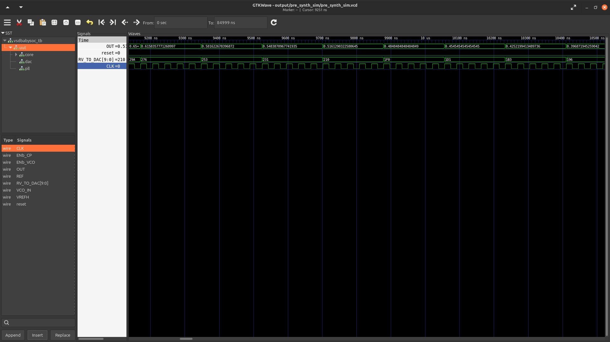

# 🌟 Week 2 – BabySoC Fundamentals & Functional Modelling 🌟  

## 🎯 Objective  
This week’s goal is to **explore SoC fundamentals** and get hands-on with **functional modelling** of the BabySoC using:  
- 🛠️ **Icarus Verilog** (compilation & simulation)  
- 📈 **GTKWave** (waveform viewing & analysis)  

---

## Project Setup  

1. **Clone the repository**  
   ```bash
   git clone https://github.com/manili/VSDBabySoC.git
   cd VSDBabySoC
   ```

2. **Directory Overview**  
   ```
   VSDBabySoC/
   ├── src/
   │   ├── include/        # Verilog headers, macro definitions
   │   ├── module/         # SoC components (rvmyth, pll, dac, top module, testbench)
   ├── output/             # Simulation outputs and waveforms
   ```

3. **Tools Required**  
   - [Icarus Verilog](http://iverilog.icarus.com/) → Compile & simulate Verilog  
   - [GTKWave](http://gtkwave.sourceforge.net/) → Open `.vcd` waveform files  

---

---

## 🧩 BabySoC Components  

- 🧠 **RVMYTH CPU** → Generates 10-bit digital data  
- ⏱️ **PLL (avsdpll)** → Produces stable clock signal  
- 🎵 **DAC (avsddac)** → Converts digital → analog output  
- 🏗️ **Top-Level (vsdbabysoc.v)** → Connects CPU, PLL, and DAC together  
- 🔬 **Testbench** → Provides reset/clock stimulus + dumps `.vcd`  

---

## 🖥️ Running Simulations  

### 🔹 Step 1: Pre-Synthesis Simulation  
```bash
iverilog -o output/pre_synth_sim/babysoc_pre.out \
  -DPRE_SYNTH_SIM \
  -I src/include -I src/module \
  src/module/testbench.v src/module/vsdbabysoc.v

cd output/pre_synth_sim
./babysoc_pre.out


- **Top-Level (`vsdbabysoc.v`)**  
  Integrates CPU (rvmyth), PLL, and DAC. Handles signal routing.  

- **RISC-V Core (`rvmyth.v`)**  
  Simple processor generating a 10-bit digital output.  

- **PLL (`avsdpll.v`)**  
  Produces a stable clock to drive the CPU.  

- **DAC (`avsddac.v`)**  
  Converts 10-bit digital input into an analog waveform.  

- **Testbench (`testbench.v`)**  
  Provides stimulus, applies reset, generates clock, and records outputs.  

---

## Simulation Flow  

### 1. Pre-Synthesis Simulation  
Compile and run:  
```bash
iverilog -o output/pre_synth_sim/babysoc_pre.out \
  -DPRE_SYNTH_SIM \
  -I src/include -I src/module \
  src/module/testbench.v src/module/vsdbabysoc.v

cd output/pre_synth_sim
./babysoc_pre.out
```

This produces `pre_synth_sim.vcd`, which can be viewed in GTKWave:  
```bash
gtkwave pre_synth_sim.vcd
```

### 2. Post-Synthesis Simulation  
```bash
iverilog -o output/post_synth_sim/babysoc_post.out \
  -DPOST_SYNTH_SIM \
  -I src/include -I src/module \
  src/module/testbench.v output/synthesized/vsdbabysoc.synth.v

cd output/post_synth_sim
./babysoc_post.out
```

Generates `post_synth_sim.vcd` for GTKWave analysis.  

---

## Observations  

### Screenshot: Pre-Synthesis Simulation  



**Explanation:**  
- **Clock (CLK):** The PLL produces a clean toggling waveform, confirming proper clock generation.  
- **Reset:** Shown in the waveform to initialize the CPU.  
- **RV_TO_DAC[9:0]:** The RISC-V core outputs varying digital values (e.g., 29A, 276, 253, 210…), which are passed to the DAC.  
- **OUT (DAC output):** The DAC translates the digital input into a smooth analog waveform, visible as continuous fractional values.  

This confirms **dataflow from CPU → DAC → OUT** is functioning as expected.  

---

## Deliverables  

- ✅ **Simulation logs** from both pre-synthesis and post-synthesis runs.  
- ✅ **GTKWave screenshot(s)** showing SoC activity.  
- ✅ **Explanation** of reset, clock, and data transfer between CPU, PLL, and DAC.  

---

## Conclusion  
By completing this lab, the BabySoC design was successfully simulated. The waveforms verify:  
- Proper reset functionality.  
- Clock synchronization via the PLL.  
- CPU-driven digital output reaching the DAC.  
- Conversion of digital signals into analog output.  

This exercise demonstrates fundamental SoC integration concepts and prepares the foundation for deeper exploration into synthesis and physical design flows.  
